# FreeCAD-themes

Theme repository for first-party FreeCAD themes.

Install the themes with the FreeCAD [Addon Manager](https://wiki.freecad.org/Std_AddonMgr), then pick one under Edit→Preferences→General→Themes.

## Themes at a glance

Click a name to jump to larger images of its details.

| [Behave-dark](#behave-dark)                           | [Behave-dark_1_1_Plus](#behave-dark_1_1_plus)                                    | [Dark-contrast](#dark-contrast)                             |
| ----------------------------------------------------- | -------------------------------------------------------------------------------- | ----------------------------------------------------------- |
| 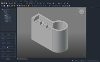 | 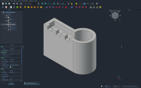 | 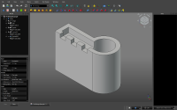 |
| [Dark-modern](#dark-modern)                           | [Darker](#darker)                                                                | [Light-modern](#light-modern)                               |
| 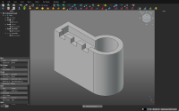 | 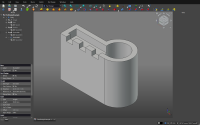                                           | 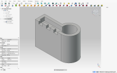    |
| [ProDark](#prodark)                                   |                                                                                  |                                                             |
| 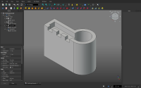             |                                                                                  |                                                             |

## Behave-dark

| Property editor                                                    | Model tree in overlay mode                                              |
| ------------------------------------------------------------------ | ----------------------------------------------------------------------- |
| 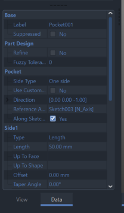 | 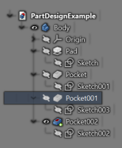 |

Full window: [docked](Behave-dark/Behave-dark.png), [overlay](Behave-dark/Behave-dark-overlay.png)

## Behave-dark_1_1_Plus

| Property editor                                                                               | Model tree in overlay mode                                                                         |
| --------------------------------------------------------------------------------------------- | -------------------------------------------------------------------------------------------------- |
| 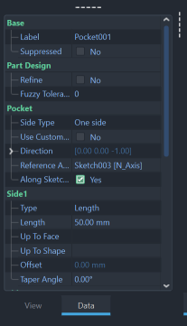 | 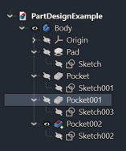 |

Full window: [docked](Behave-dark_1_1_Plus/Behave-dark_1_1_Plus.png), [overlay](Behave-dark_1_1_Plus/Behave-dark_1_1_Plus-overlay.png)

## Dark-contrast

| Property editor                                                          | Model tree in overlay mode                                                    |
| ------------------------------------------------------------------------ | ----------------------------------------------------------------------------- |
| 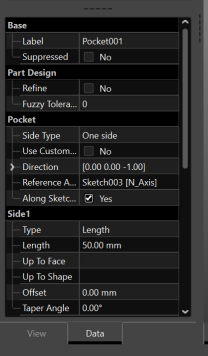 | 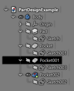 |

Full window: [docked](Dark-contrast/Dark-contrast.png), [overlay](Dark-contrast/Dark-contrast-overlay.png)

## Dark-modern

| Property editor                                                    | Model tree in overlay mode                                              |
| ------------------------------------------------------------------ | ----------------------------------------------------------------------- |
| 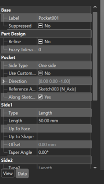 |  |

Full window: [docked](Dark-modern/Dark-modern.png), [overlay](Dark-modern/Dark-modern-overlay.png)

## Darker

| Property editor                                     | Model tree in overlay mode                               |
| --------------------------------------------------- | -------------------------------------------------------- |
| 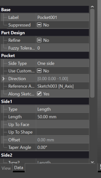 | 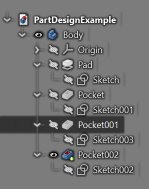 |

Full window: [docked](Darker/Darker.png), [overlay](Darker/Darker-overlay.png)

## Light-modern

| Property editor                                                       | Model tree in overlay mode                                                 |
| --------------------------------------------------------------------- | -------------------------------------------------------------------------- |
| 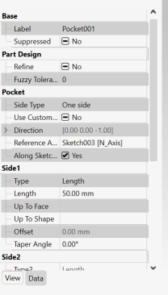 | 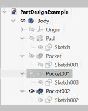 |

Full window: [docked](Light-modern/Light-modern.png), [overlay](Light-modern/Light-modern-overlay.png)

## ProDark

| Property editor                                        | Model tree in overlay mode                                  |
| ------------------------------------------------------ | ----------------------------------------------------------- |
| 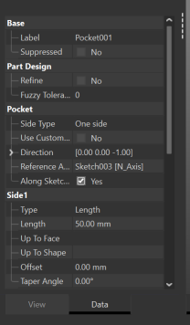 | 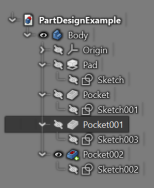 |

Full window: [docked](ProDark/ProDark.png), [overlay](ProDark/ProDark-overlay.png)
